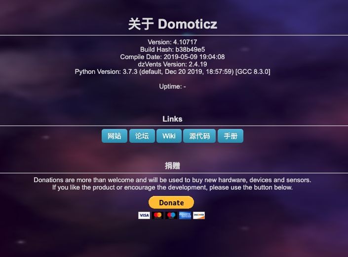
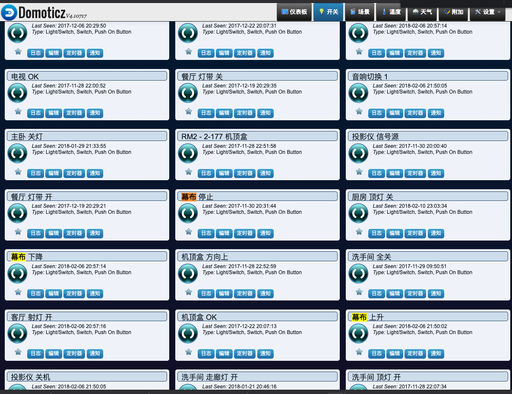

BroadlinkRM2 Domotizc Plugin插件
===

插件原始的wiki页面http://www.domoticz.com/wiki/plugins/BroadlinkRM2.html，已经无法访问了。
并且网上随便一搜，关于这个插件的文章都是四年以前的。新的内容基本没有。
虽然一直在用这个插件，但是这个插件配置起来却一点都不轻松，插件依赖于broadlink库。
而这个库在树莓派上安装的时候，虽然能安装成功。但是安装 成功之后多数时间会找不到这个库，从而导致插件启动失败。  
插件项目地址：  
https://github.com/mjg59/python-broadlink
看项目简介现在已经支持Broadlink RM2, RM3 and RM4 series controllers 。  
其实要解决库找不到的问题也简单，不要用pip之类的安装。直接将python-broadlink的broadlink目录拷贝到BroadlinkRM2目录下就可以解决这个问题。  
插件进行库搜索的时候会搜索当前插件目录下的库，所以没有必要安装之后再去进行拷贝。
我这里集成的是旧版本的python-broadlink库，如果需要可以替换为新版的库。新版本我没有测试，如果测试ok可以提交个补丁进行说明。  

经过测试domoticz 4.10717版本测试正常    

开关效果：  

使用方法：  
正常安装domoticz之后，将BroadlinkRM2复制到plugin目录下，重启domoticz。然后进入硬件设置页面进行设置即可。

- @author: obaby  
- @license: (C) Copyright 2013-2020, obaby@mars.  
- @contact: root@obaby.org.cn  
- @link: http://www.obaby.org.cn  
- @blog: http://www.h4ck.org.cn  
- @findu: http://www.findu.co
